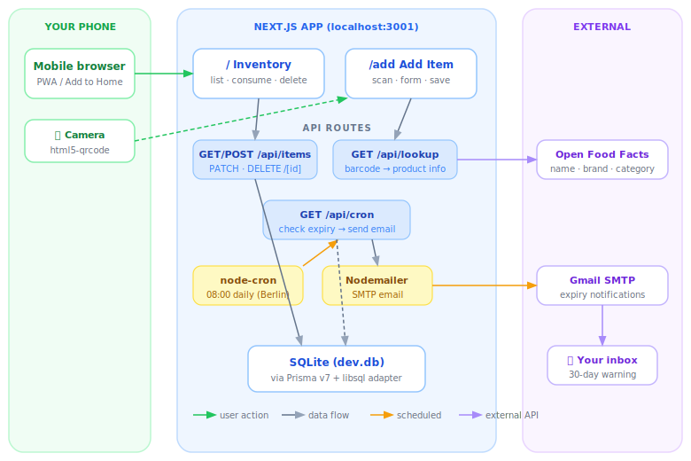

# 🥘 Pantry Tracker

> A self-hosted, mobile-first PWA that scans barcodes, tracks expiry dates, and keeps your pantry under control.

[](https://github.com/judkacag/pantry-tracker/actions/workflows/ci.yml)
[](LICENSE)
[](https://nextjs.org)
[](https://en.wikipedia.org/wiki/Berlin)

---

## Why

I kept throwing out food that had quietly expired at the back of the cupboard. I looked at existing tools but they were more than I needed, so I built a simple version that covers my current use case: scan something when it goes in, and see at a glance what needs using up.

---

## What it does

| Feature | Detail |
|---|---|
| **Barcode scan** | Point your phone camera at any product — details auto-fill from Open Food Facts |
| **Rich product data** | Name, brand, category, packaging type, pack size, nutri-score, labels, and product photo — all pulled automatically and editable |
| **Manual override** | Every field can be edited after scanning, or filled in entirely by hand if a product isn't in the database |
| **Expiry tracking** | Colour-coded urgency groups: expired · expiring soon · use this month · plenty of time |
| **Swipe actions** | Swipe left to mark as used or delete — deducts quantity when you have more than one |
| **Search & filter** | Instant search + multi-select filter by urgency level and category |
| **Group views** | Switch between Urgency, Category, and All items |
| **PWA** | Install to your home screen — works like a native app, no App Store needed |
| **Pantry AI chat** | Floating chat widget — paste a recipe link and it tells you what you already have, with expiry-first suggestions for each ingredient |

---

## Architecture



Four zones:
- **Your phone** — browser PWA with camera barcode scanning (`html5-qrcode`) and manual entry fallback
- **Next.js app** — API routes for items, product lookup, and AI chat; SQLite database; all logic stays local
- **Open Food Facts** — free, open product database; returns name, brand, category, packaging type, pack size, nutri-score, dietary labels, and product photo. No API key required.
- **Groq (LLM)** — powers the Pantry AI chat widget; fetches recipe pages, extracts ingredients, matches against the live pantry with expiry-first logic. Free tier at [console.groq.com](https://console.groq.com).

---

## Tech stack

| Layer | Choice | Why |
|---|---|---|
| Framework | [Next.js 16](https://nextjs.org) (App Router) | Full-stack in one repo, great PWA support |
| Styling | Tailwind CSS + inline styles | Mobile-first, design-token driven |
| Barcode | [html5-qrcode](https://github.com/mebjas/html5-qrcode) | Runs in the browser, no native app needed |
| Product data | [Open Food Facts](https://world.openfoodfacts.org) | Free, open, strong EU coverage |
| Database | SQLite via [Prisma v7](https://www.prisma.io) + libsql | Zero-config, file-based, easy to migrate |
| AI chat | [Groq](https://groq.com) + Llama 3.3 70B | Free tier, fast inference, no EU quota issues |
| Font | [Jost](https://fonts.google.com/specimen/Jost) | Clean and readable on mobile |

---

## Getting started

### Prerequisites

- Node.js 20+
- npm

### 1. Clone and install

```bash
git clone https://github.com/judkacag/pantry-tracker.git
cd pantry-tracker
npm install
```

### 2. Configure environment

```bash
cp .env.example .env
```

Copy the example and fill in your values:

```env
DATABASE_URL="file:./prisma/dev.db"

# Optional — enables the Pantry AI chat widget
# Free tier: https://console.groq.com
GROQ_API_KEY=
```

### 3. Set up the database

```bash
npx prisma migrate dev
```

### 4. Run

```bash
npm run dev
```

Open [http://localhost:3000](http://localhost:3000). On mobile, connect to the same WiFi and open your machine's local IP — e.g. `https://192.168.0.41:3000`.

> **Note:** Camera access for barcode scanning requires HTTPS. Run with `next dev --experimental-https` for mobile testing.

---

## Roadmap

- [x] Barcode scan → Open Food Facts auto-fill
- [x] Rich product data: name, brand, category, packaging, pack size, nutri-score, labels, photo
- [x] Manual entry and field override after scanning
- [x] Expiry tracking with colour-coded urgency groups
- [x] Swipe to consume / delete with quantity deduction
- [x] Search + filter by urgency and category
- [x] Group views: urgency, category, all items
- [x] PWA / installable on mobile
- [x] Pantry + fridge as separate locations
- [x] Pantry AI chat — paste a recipe link, get a ✅/❌ ingredient check against your pantry
- [ ] Photo / OCR scanning of expiry dates (so you don't have to type the date)
- [ ] Shopping suggestions when stock is running low
- [ ] Shared household access (multi-user)
- [ ] Cloud deploy on Hetzner with Tailscale

---

## License

[MIT](LICENSE) · Built by [Judit Bekker](https://github.com/judkacag) with [Claude Code](https://claude.ai/code)
